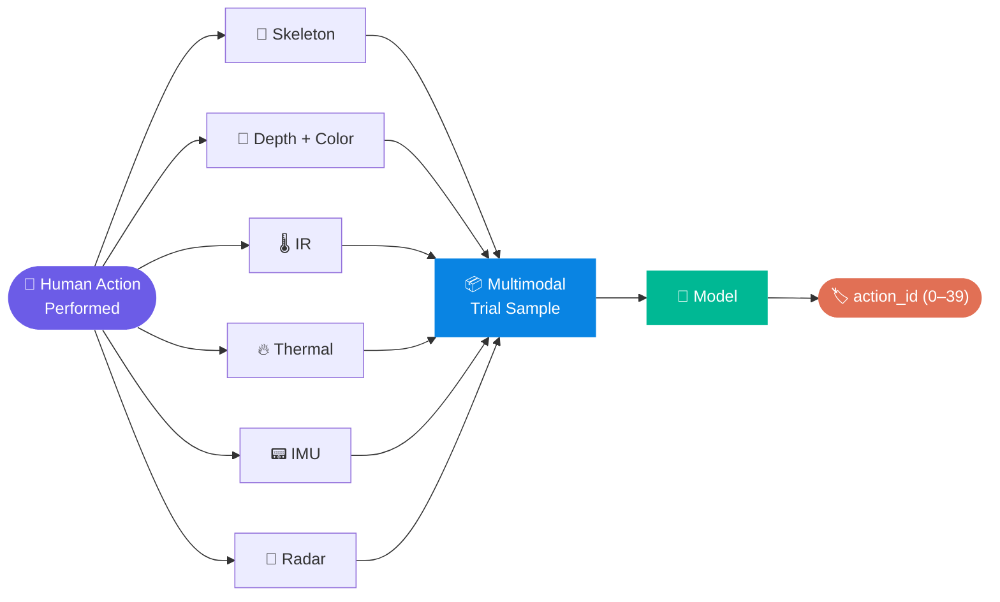
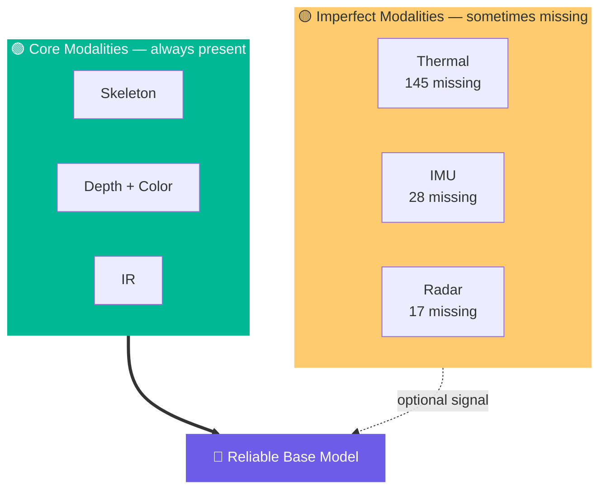
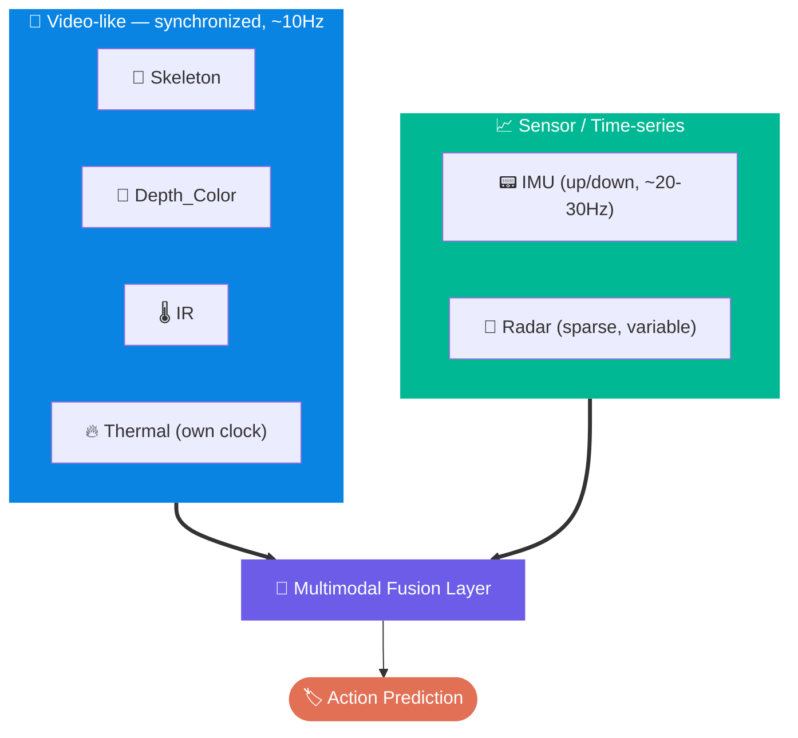
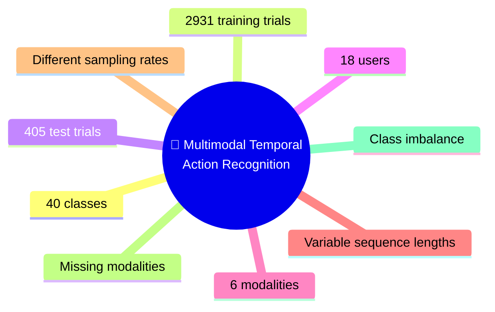

<div align="center">

# 🏃‍♂️✨ Multimodal Human Action Recognition
### *Competition Dataset Deep-Dive & Modeling Strategy*

A 40-class human action recognition challenge fusing **Skeleton · Depth/Color · IR · Thermal · IMU · Radar** across 18 users.

<p>


</p>

</div>

<br>

> [!NOTE]
> This is **not** a simple image classification task — it's a **multimodal, temporal, imbalanced, and imperfectly-sensored** action recognition problem. Every section below feeds into that conclusion.

<br>

## 📖 Table of Contents

<table>
<tr>
<td valign="top" width="50%">

1. [🎯 Overview](#-overview)
2. [🗂 Dataset Structure](#-dataset-structure)
3. [🏷 Action Classes](#-action-classes)
4. [👥 Users & Leakage Risk](#-users--leakage-risk)
5. [⚖️ Class Imbalance](#️-class-imbalance)
6. [🧩 Modality Availability](#-modality-availability)
7. [⏱ Sampling Rate Mismatch](#-sampling-rate-mismatch)

</td>
<td valign="top" width="50%">

8. [🔬 Modality Deep Dives](#-modality-deep-dives)
9. [🔗 Cross-Modality Grouping](#-cross-modality-grouping)
10. [🧪 Test Set](#-test-set)
11. [💡 Key Insight](#-key-insight)
12. [🚫 Pitfalls to Avoid](#-pitfalls-to-avoid)
13. [✅ Recommended Approach](#-recommended-approach)

</td>
</tr>
</table>

<br>

---

## 🎯 Overview

<table>
<tr><td width="60%">

The task is **40-class human action recognition**. Each sample ("trial") represents one human action captured simultaneously across **six sensing modalities**.

**Objective:** predict the `action_id` (0–39) for every test trial and produce a valid `submission.csv`.

</td>
<td width="40%">

| Modality | Icon |
|---|:---:|
| Skeleton | 🦴 |
| Depth + Color | 🎨 |
| IR | 🌡️ |
| Thermal | 🔥 |
| IMU | 📟 |
| Radar | 📡 |

</td></tr>
</table>



<br>

---

## 🗂 Dataset Structure

```
small-model-track/
│
├── 📁 Training/
│   └── Training/
│       ├── data/
│       │   ├── Skeleton/
│       │   ├── Depth_Color/
│       │   ├── IR/
│       │   ├── Thermal/
│       │   ├── IMU/
│       │   └── Radar/
│       └── class_mapping.csv
│
├── 📁 Testing/
│   └── Testing/
│       └── small_model_track_test-007/
│           └── small_model_model_track_test/
│               ├── SM_test_0001/
│               ├── SM_test_0002/
│               └── ... (405 total)
│
├── 📄 test.csv
├── 📄 sample_submission.csv
├── 📄 README.md
├── 🐍 fix_in_place.py
└── 📦 fix_zip_name
```

> 💬 There are **405 test directories** (`SM_test_0001` → `SM_test_0405`), each representing one prediction sample.

<br>

---

## 🏷 Action Classes

<div align="center">

**40 action classes**, spanning hygiene, dining, chores, desk work, leisure, and exercise.

</div>

<details open>
<summary><b>📋 Click to expand full class list</b></summary>

<br>

| ID | Action | | ID | Action |
|:---:|---|---|:---:|---|
| 0 | 🧼 Wash face | | 20 | ⏰ Check the time |
| 1 | 🪥 Brush teeth | | 21 | 📄 Read documents |
| 2 | 💇 Comb hair | | 22 | 📖 Turn pages |
| 3 | 👕 Take off clothes | | 23 | 🎧 Listen to music with headphones |
| 4 | 🤲 Wipe hands | | 24 | 📱 Use a mobile phone |
| 5 | 👔 Put on clothes | | 25 | 📺 Watch TV |
| 6 | 🥤 Drink water | | 26 | 🎮 Play games |
| 7 | 🍽️ Eat food | | 27 | 🤳 Take a selfie |
| 8 | 🍴 Take and use tableware | | 28 | 🏃 Jog in place |
| 9 | 🍶 Pour drinks | | 29 | 🏋️ Do squats |
| 10 | 🥄 Stir drinks | | 30 | 🤸 Do jumping jacks |
| 11 | 🍎 Peel fruits | | 31 | 🧘 Do stretching exercises |
| 12 | 🧹 Sweep the floor | | 32 | 🧍 Stand up |
| 13 | 🧽 Mop the floor | | 33 | 🛌 Lie down |
| 14 | 🥣 Wipe bowls | | 34 | 🪑 Sit down |
| 15 | 🪟 Wipe windows and tables | | 35 | 🦵 Do lunges |
| 16 | 👚 Fold clothes | | 36 | 🚶 Walk |
| 17 | ⌨️ Tap the keyboard | | 37 | 💊 Take medicine |
| 18 | ✍️ Write | | 38 | 💆 Massage oneself |
| 19 | 📞 Make a phone call | | 39 | 🌡️ Take body temperature |

</details>

<br>

---

## 👥 Users & Leakage Risk

There are **18 users**, but their IDs are **not contiguous**:

<div align="center">

`user1` `user2` `user3` `user4` `user5` `user6` `user7` `user8` `user9` `user16` `user17` `user18` `user19` `user20` `user21` `user22` `user23` `user24`

</div>

> [!WARNING]
> **Users 10–15 are missing entirely.** User identity and personal movement style can leak into predictions — validation **must be user-independent**. A naive random train/val split risks data leakage.

<details>
<summary><b>📊 Click to see training samples per user</b></summary>

<br>

| User | Samples | | User | Samples |
|---|:---:|---|---|:---:|
| user1 | 149 | | user16 | 186 |
| user2 | 167 | | user17 | 166 |
| user3 | 161 | | user18 | 178 |
| user4 | 134 | | user19 | 186 |
| user5 🔻min | 100 | | user20 | 159 |
| user6 🔺max | 201 | | user21 | 133 |
| user7 | 184 | | user22 | 191 |
| user8 | 165 | | user23 | 131 |
| user9 | 181 | | user24 | 159 |

</details>

Total: **2,931 trials** — each identified as `action + user + trial` (e.g. `0_Wash_face / user16 / 1-1-1`)

<br>

---

## ⚖️ Class Imbalance

<div align="center">

### The dataset is **strongly imbalanced** — a critical modeling consideration

</div>

<table>
<tr>
<td valign="top" width="50%">

#### 📈 Most frequent

| Class | Count |
|---|---:|
| 36_Walk | **335** |
| 7_Eat_food | 154 |
| 34_Sit_down | 147 |
| 9_Pour_drinks | 131 |
| 6_Drink_water | 120 |
| 10_Stir_drinks | 117 |
| 11_Peel_fruits | 106 |
| 8_Take_and_use_tableware | 97 |

</td>
<td valign="top" width="50%">

#### 📉 Least frequent

| Class | Count |
|---|---:|
| 25_Watch_TV | **12** |
| 16_Fold_clothes | 24 |
| 35_Do_lunges | 26 |
| 33_Lie_down | 33 |
| 14_Wipe_bowls | 35 |
| 28_Jog_in_place | 37 |
| 18_Write | 38 |

</td>
</tr>
</table>

> [!IMPORTANT]
> Do **not** rely solely on raw accuracy. Track: ✅ Macro F1 · ✅ Per-class accuracy · ✅ Confusion matrix · ✅ Validation accuracy
>
> Minority classes (like `Watch TV`, only 12 samples) can easily be ignored by a model optimizing overall accuracy alone.

<br>

---

## 🧩 Modality Availability

<div align="center">

| Modality | Missing Trials | Status |
|---|:---:|:---:|
| Skeleton | 0 | 🟢 |
| Depth_Color | 0 | 🟢 |
| IR | 0 | 🟢 |
| IMU | 28 | 🟡 |
| Radar | 17 | 🟡 |
| Thermal | 145 | 🟠 |

</div>



**Strategy:** Build the first architecture on **Skeleton + Depth/Color + IR** (100% coverage), then investigate whether **Thermal + IMU + Radar** add incremental value.

<br>

---

## ⏱ Sampling Rate Mismatch

Modalities are **not synchronized** at the same frequency. Example trial `0_Wash_face / user16 / 1-1-1`:

<div align="center">

| Modality | Frames/Rows | Duration | Approx. Rate |
|---|:---:|:---:|:---:|
| Skeleton | 47 | 4.6 sec | ~10 Hz |
| Depth/Color | 47 | 4.6 sec | ~10 Hz |
| IR | 47 | 4.6 sec | ~10 Hz |
| Thermal | 106 | — | own clock |
| IMU (lower) | 90 | ~4.41 sec | ~20.18 Hz |
| IMU (upper) | 137 | ~4.49 sec | ~30.29 Hz |
| Radar | 1 (this file) | — | sparse |

```mermaid
gantt
    dateFormat X
    axisFormat %s
    title Relative Sampling Density Over ~4.6s Trial (example)
    section Skeleton/Depth/IR (~10Hz)
    47 samples :a1, 0, 47
    section Thermal (own clock)
    106 samples :a2, 0, 106
    section IMU Lower (~20Hz)
    90 samples :a3, 0, 90
    section IMU Upper (~30Hz)
    137 samples :a4, 0, 137
```

</div>



> ⚠️ This mismatch means **temporal alignment/resampling is required before fusion.**

<br>

---

## 🔬 Modality Deep Dives

### 🔥 Thermal

| Property | Value |
|---|---|
| Numbering | Frame-numbered (`frame_000389.jpg` → `frame_000494.jpg`), no gaps |
| Filesystem times | ⚠️ Identical across all files — **not usable** as capture timestamps |
| Format | JPEG, 320×240, RGB, 8-bit, 3 channels, quality ≈ 95 |
| Key caveat | Stored as **RGB JPEGs**, not raw temperature matrices — treat as images, don't assume RGB = physical temperature |

### 📟 IMU

Each trial has two CSV files:

| File | Meaning |
|---|---|
| `up(LA+RA+C).csv` | Upper-body sensors (left arm, right arm, chest) |
| `down(LL+RL).csv` | Lower-body sensors (left leg, right leg) |

<table>
<tr>
<td valign="top" width="50%">

**Signal groups:**

| Group | Fields |
|---|---|
| Accelerometer | X, Y, Z |
| Gyroscope | X, Y, Z |
| Orientation | X, Y, Z |
| Magnetometer | X, Y, Z |
| Quaternion | 0, 1, 2, 3 |
| ~~Other (low value)~~ | ~~temp, battery, version~~ |

</td>
<td valign="top" width="50%">

✅ **Use for modeling:**
- Accelerometer
- Gyroscope
- Quaternion
- Orientation

🚫 **Skip:**
- Battery, temperature, version

</td>
</tr>
</table>

> Sampling difference (example trial): **upper ≈ 30 Hz** (137 rows) vs **lower ≈ 20 Hz** (90 rows) → the two streams need separate temporal handling before fusion.

<details>
<summary><b>📊 Click to see action-level IMU signal stats</b></summary>

<br>

| Action | Accel X mean/std | Gyro std (X / Y / Z) |
|---|---|---|
| Wash face | mean -0.202 | 122 / 49.7 / 132.9 |
| Squats | mean -0.424 | 117.7 / 75.9 / 98.9 |
| Jumping jacks | std 1.908 | 319 / 254 / 378 |
| Walking | std 0.494 | 44 / 135 / 51 |
| Keyboard tapping | std 0.298 | — |
| Writing | std 0.164 | — |

➡️ High-motion actions (jumping jacks) show clearly higher variance than low-motion actions (writing) — **IMU is strongly discriminative.**

</details>

> [!CAUTION]
> **Filenames are inconsistent**, including Chinese-character variants and typos:
> ```
> up(LA+RA+C).csv        2870      下(RL+LL).csv           20
> down(LL+RL).csv        2875      上(RA+LA+C).csv         26
> 上(LA+RA+C)_.csv           3      上(RLA+RA+C).csv         4
> 下(LL+RL)).csv             2      下 (LL+RL).csv           6
> ```
> Preprocessing must use **flexible filename normalization/matching**, not exact string matches.

### 📡 Radar

<div align="center">

| Metric | Value |
|---|---:|
| Total CSV files | 2,914 |
| Header-only (empty) | 1,505 |
| Contains measurements | 1,409 |
| Total data rows | **545,329** |

</div>

➡️ Radar is **not empty**, but ~half its files are header-only — requires careful auditing (column meaning, points per trial, temporal structure, correlation with specific actions) before use in a deep model.

<br>

---

## 🔗 Cross-Modality Grouping

Frame/trial counts reveal a natural grouping for architecture design:



**Skeleton ≈ Depth_Color ≈ IR** almost always match in frame count → naturally suited for early/mid fusion. Thermal, IMU, and Radar are structured differently and likely need separate encoders before late fusion.

<br>

---

## 🧪 Test Set

<table>
<tr>
<td valign="top" width="55%">

**Structure** (example `SM_test_0001/`):

```
SM_test_0001/
│
├── Skeleton/
│   └── predictions/
├── Radar/
│   └── radar_output_....csv
├── Thermal/
├── IR/
├── IMU/
│   ├── up...
│   └── down...
└── Depth_Color/
```

</td>
<td valign="top" width="45%">

**Example counts:**

| Modality | Count |
|---|:---:|
| Skeleton | 20 |
| IR | 20 |
| Depth_Color | 20 |
| Thermal | 49 |
| IMU | 2 CSVs |
| Radar | 1 CSV |

</td>
</tr>
</table>

- **405 test trials** total
- `test.csv` → columns `path`, `prediction` (empty initially) e.g. `small_model_track_test/SM_test_0001/`
- `sample_submission.csv` shares the same paths — **match its exact structure** for the final submission ✅

<br>

---

## 💡 Key Insight



<div align="center">

> ### This is **not** a simple image classification problem.
> ### It is a **multimodal, temporal, human-action recognition problem.**

</div>

<br>

---

## 🚫 Pitfalls to Avoid

| ❌ Don't | Why |
|---|---|
| Single RGB frame → ResNet → classifier | Discards nearly all temporal and multimodal information |
| Random split of individual frames | Frames from the same trial/user leak across train/val |
| Jump straight to a huge 6-modality Transformer | Only 2,931 trials — high overfitting risk |
| Assume exact IMU filenames | Naming is inconsistent (Chinese variants, typos, extra chars) |
| Trust filesystem timestamps for Thermal | All identical — not real capture times |
| Optimize for raw accuracy only | Hides poor performance on minority classes |

<br>

---

## ✅ Recommended Approach


<table>
<tr><td>

1. **Validation strategy** — Split by user, not randomly, to avoid identity leakage.
2. **Reliable base** — Start with Skeleton + Depth/Color + IR (100% coverage, matched frame counts).
3. **Temporal alignment** — Resample/interpolate modalities to a common time base before fusion.
4. **Auxiliary signal** — Bring in IMU (accel/gyro/quaternion/orientation) as a strong motion-discriminative branch.
5. **Careful audit** — Investigate Thermal and Radar structure before committing to their use.
6. **Imbalance handling** — Class-weighted loss, macro-F1 as primary metric, confusion-matrix review.
7. **Model size** — Keep the architecture modest given only 2,931 training trials.
8. **Submission format** — Mirror `sample_submission.csv` exactly (`path`, `prediction`) for all 405 test trials.

</td></tr>
</table>

<br>

<div align="center">

---

*📌 Generated from competition dataset audit notes.*

</div>
